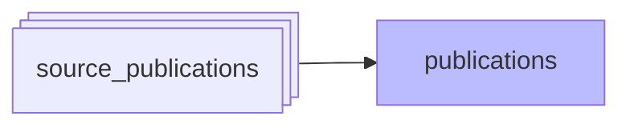
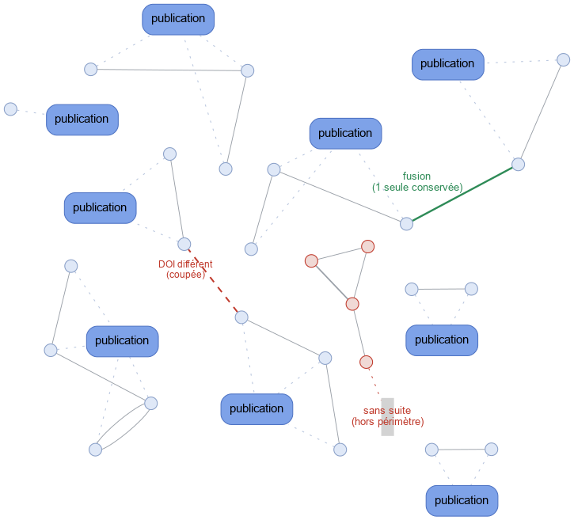

#  Création et résolution des publications

*À jour le 2026-09-06.*

```mermaid
flowchart LR
    A@{ shape: procs, label: "source_publications"}-->B[publications]
    classDef new  fill:#bbf
    class B new;
```

Phase `publications` : maintient le référentiel `publications` à partir des `source_publications`. Une publication regroupe toutes les `source_publications` qui attestent du même document, quelles que soient leurs sources. La phase rattache chaque `source_publication` à la bonne publication, en crée une lorsqu'aucune ne convient, et fusionne ou scinde les publications existantes quand le regroupement le commande.

## Reconnaître le même document

Deux `source_publications` désignent le même document si elles partagent une **clé de confirmation**.

- **Identifiants** : DOI, NNT (numéro national de thèse), identifiant HAL, PMID (PubMed), identifiant arXiv. Égalité directe.
- **Bloc de métadonnées** : le triplet `type de document | titre normalisé | année`. Deux documents de même type, même titre et même année sont tenus pour identiques. Une longueur minimale de titre écarte les collisions de titres trop génériques.

Ces clés sont projetées par `domain/source_publications/keys.py`, à partir des colonnes déjà normalisées (phase `normalize`) puis corrigées (phase `metadata_correction`).

## Regrouper, puis assigner

Les `source_publications` reliées par au moins une clé partagée forment les **composantes connexes** d'un graphe. Une règle prime sur le regroupement : **deux DOI distincts ne désignent jamais le même document**. Une composante qui porte plusieurs DOI est donc découpée en une partition par DOI.

Chaque partition aboutit sur une seule publication. L'assignation choisit laquelle :

- **Rattachement** : la partition contient déjà une publication existante → toutes ses `source_publications` y sont rattachées.
- **Fusion** : la partition réunit plusieurs publications existantes → une seule est conservée, les autres sont absorbées.
- **Création** : la partition ne contient aucune publication existante → une publication est créée si au moins une `source_publication` de la partition est dans le périmètre.
- **Scission** : une publication existante se retrouve à cheval sur plusieurs partitions → elle reste sur une seule d'entre elles, et une publication est créée pour chacune des autres.
- **Sans suite** : à défaut, les `source_publications` de la partition restent orphelines.

Le périmètre ne conditionne que la création : une `source_publication` hors périmètre peut se rattacher à une publication existante.

*Chaque nœud est une `source_publication`, chaque arête pleine relie deux `source_publications` qui partagent une clé de confirmation, chaque ligne en pointillés rattache une `source_publication` à sa publication (boîtes).*

## Traitement incrémental

Une `source_publication` modifiée (insérée, re-normalisée, corrigée) est marquée *à recalculer*, et la phase ne traite que le **voisinage direct** de ces `source_publications` — celles avec lesquelles elles partagent une clé.

> **Conséquence** :
> Après toute modification de la logique de résolution, il faut marquer toutes les publications *à recalculer* pour que le changement s'applique au stock : lancer le pipeline avec l'option `--rebuild-publications`.

## Rafraîchissement des métadonnées

Une fois les rattachements posés, les métadonnées de chaque publication touchée sont recalculées par agrégation de ses `source_publications`. Les publications vidées de toutes leurs `source_publications` sont supprimées. Enfin, le décompte de publications par adresse (`addresses.pub_count`) est recalculé pour refléter les créations, fusions et scissions.
