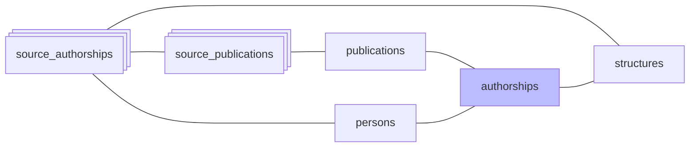

#  Authorships

Phase `authorships`: `build_authorships` construit la table `authorships` en 5 étapes :

1. **Insertion** des paires (publication_id, person_id) manquantes, depuis les `source_authorships` (toutes sources : HAL, OpenAlex, WoS, ScanR, theses, CrossRef), **sauf** les paires présentes dans `rejected_authorships` (rejet manuel, anti-join)
2. **FK** : rattache chaque `source_authorships` à son authorship canonique via `source_authorships.authorship_id`
3. **Métadonnées** : propage `author_position` et `is_corresponding` selon `SOURCE_PRIORITY` (theses > CrossRef > ScanR > HAL > OpenAlex > WoS)
4. **UCA** : propage `in_perimeter` (OR) depuis toutes les sources (déjà calculé dans la phase [affiliations](05-affiliations.md))
5. **Structures** : `REFRESH … CONCURRENTLY` de la matview `authorship_structures` (union des `source_authorship_structures` des sa reliées)

Les publications de type `peer_review` et `memoir` (cf. `OUT_OF_SCOPE_DOC_TYPES` dans `domain/publications/scope.py`) sont exclues de la propagation UCA.