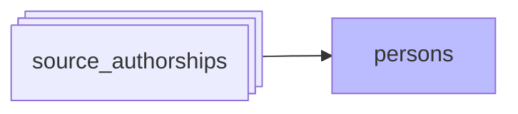

#  Résolution et création des personnes

*À jour le 2026-09-06.*

La phase `persons` rattache chaque signature à une personne, et crée les personnes que les sources font apparaître. Ses étapes tournent dans une seule transaction : la remise à zéro des attributions douteuses et leur re-résolution doivent commiter ensemble.

1. **Épinglages** — réapplique les signatures épinglées à la main sur une personne (`confirmed_authorships`), avant toute dérivation.

2. **Arbitrage des conflits d'identifiant** — une valeur d'identifiant que deux personnes se disputent revient à celle que soutient la majorité des signatures qui la portent. Les signatures qui la captaient redeviennent orphelines, et la cascade les re-résout.

3. **Cascade** — interroge, pour chaque signature orpheline, les signaux ci-dessous du plus fiable au moins fiable.

4. **Détachement cross-source** — les rattachements obtenus par ancrage cross-source qui ne reposent plus sur une ancre ferme redeviennent orphelins.

5. **Formes de nom** — régénère `person_name_forms` depuis les personnes (variantes prénom/nom, nom/prénom, initiales) et depuis le nom normalisé des signatures.

6. **Purge** — une forme de nom devenue ambiguë après cette régénération détache les signatures purement nominales qui s'y rattachaient. Les personnes ainsi vidées sont supprimées, hors référentiel RH.

## Les signaux de la cascade

1. **Identifiant ORCID déposé par l'auteur** : ORCID présent dans les métadonnées Crossref de la publication, dans le `raw_orcid` d'OpenAlex, ou dans le TEI HAL (`label_xml`) — soit les sources où l'ORCID est déposé par l'auteur (`ORCID_MATCH_SOURCES`). Les ORCID ajoutés algorithmiquement par la source sont écartés (`author.orcid` dans OpenAlex, distingué de `raw_orcid` ; dans WoS, pas de distinction possible, `PreferredORCID` est ignoré en entier).

2. **Compte HAL** : `hal_person_id`, attaché à la signature dans le TEI. Vient après l'ORCID déposé : le rattachement de la signature au compte peut être faux (identification automatisée au dépôt, homonymie sur les publications multi-auteurs), risque que l'ORCID déposé n'a pas.

3. **Identifiant IdRef** : PPN SUDOC (HAL TEI, ScanR, theses.fr), référentiel personnes de l'ESR.

4. **Recherche par nom** : nom normalisé désignant une seule personne dans `person_name_forms`. Un nom qui en désigne plusieurs laisse la signature orpheline, pour traitement manuel via `admin/orphan-authorships`.

5. **Ancrage cross-source** : sur la même publication, vue depuis une autre source, une signature déjà rattachée à une personne occupe la même position dans la liste des auteurs, et son nom est compatible. Vient en dernier : il exploite les ancres que les quatre signaux précédents viennent de poser.

> **Corroboration par le nom.** Un match par identifiant (ORCID, `hal_person_id`, IdRef) n'est retenu que si le nom de la signature est compatible avec celui du propriétaire de la valeur : un identifiant recopié sur le mauvais co-auteur est refusé, la signature retombe sur les signaux suivants.

> **Garde de rejet.** À chaque signal, les personnes rejetées manuellement pour la publication (paires `(publication, personne)` du store `rejected_authorships`) sont **éliminées des candidats** : un match — par identifiant, par nom ou cross-source — ne peut pas recréer une paire rejetée. L'élimination peut aussi **désambiguïser** une recherche par nom : si une forme ambiguë correspond à 2 personnes dont l'une est rejetée pour cette publication, il ne reste qu'une candidate et le rattachement devient univoque.

### Rattacher, puis créer

La cascade fait deux passes sur ces signaux. La première rattache sans jamais créer. La seconde reprend les signatures restées orphelines et les rejuge sur les deux derniers signaux seulement, puisqu'aucun identifiant ne les a prises ; un nom inconnu donne alors une personne neuve.

Cette seconde passe voit les rattachements que la première vient de poser. Deux graphies du même auteur aux formes de nom disjointes — « Jean Martin » et « J-P Martin » — se rejoignent donc par ancrage cross-source, au lieu de donner deux personnes selon l'ordre de traitement.

### Périmètre

Une signature du périmètre est éligible à tous les signaux. Une signature hors périmètre n'est rattachable que par identifiant fort ou par ancrage cross-source : le signal du nom lui est fermé, si bien qu'un nom seul ne peut ni créer une personne ni y attacher une signature hors périmètre.

## Indépendance de l'ordre d'ingestion

Le résultat ne dépend pas de l'ordre dans lequel les sources ont été moissonnées. La phase ne fige aucun rattachement dérivé : à chaque exécution, elle les rejuge tous contre l'état ferme de tout le corpus. Les saisies manuelles — épinglage d'une signature, formes de nom confirmées ou rejetées, personnes déclarées distinctes, notices du référentiel RH — sont des entrées fixes, jamais réinitialisées.

C'est ce qui permet de rattraper une forme réduite. Une initiale seule (« J Martin ») crée sa propre personne ; la forme pleine (« Jean Martin ») rencontrée plus tard en crée une seconde. La purge supprime la personne réduite une fois vidée, ce qui retire sa forme et lève l'ambiguïté ; ses signatures rejoignent la personne pleine à l'exécution suivante.
