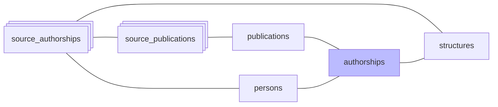

#  Authorships

*À jour le 2026-09-06.*

La phase `authorships` consolide en une table les signatures que rapportent toutes les sources : une ligne par couple publication-personne, dont les attributs résument ce que ces sources en disent. La construction est incrémentale et convergente — les attributs divergents sont réécrits, les paires que plus aucune source n'atteste sont supprimées — si bien qu'une relance aboutit au même état. `run_pipeline --rebuild-authorships` reconstruit la table entière.

1. **Insertion** des paires (publication, personne) manquantes, **sauf** celles présentes dans `rejected_authorships` (rejet manuel, anti-join).
2. **Élagage** des authorships orphelines : les paires que plus aucune `source_authorship` n'atteste sont supprimées.
3. **Rattachement** : chaque `source_authorship` pointe vers son authorship via `source_authorships.authorship_id`.
4. **Recomposition des attributs**, en une passe. `author_position` vient de la source la plus prioritaire qui le renseigne : theses > Crossref > DataCite > HAL > OpenAlex > ScanR > WoS. `is_corresponding`, `in_perimeter` et `roles` sont des unions : les booléens sont vrais dès qu'une source les porte.
5. **Report sur les publications** : `publications.in_perimeter` est matérialisé, pour que les filtres de liste lisent un drapeau au lieu de recalculer l'appartenance au périmètre à chaque requête.
6. **Rafraîchissement des vues matérialisées** `authorship_structures` et `publication_structures`, qui rattachent authorships et publications à leurs structures.

## Opérations finales

- **Purge des publications orphelines** : une publication qui ne porte plus aucune authorship, par exemple sortie du périmètre, est supprimée.
- **Recalcul des `pub_count`** des revues et des éditeurs, qui dérivent du nombre de publications du périmètre.
