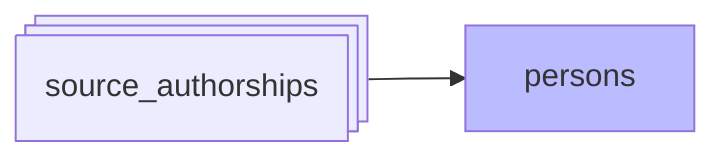

#  Matching et création de personnes

*À jour le 2026-07-08.*

Phase `persons`:
`create_persons_from_source_authorships` — cascade en 5 étapes, du signal le plus fiable au moins fiable (décideur pur `decide_person_match`) :

1. **Identifiant ORCID déposé par l'auteur** : ORCID présent dans les métadonnées Crossref de la publication, dans le `raw_orcid` d'OpenAlex, ou dans le TEI HAL (`label_xml`) — soit les sources où l'ORCID est déposé par l'auteur (`ORCID_MATCH_SOURCES`). On ignore les ORCID ajoutés algorithmiquement par la source (`author.orcid` dans OpenAlex, distingué de `raw_orcid` ; dans WoS, pas de distinction possible — `PreferredORCID` ignoré en entier).

2. **Compte HAL** : `hal_person_id` (compte HAL de l'auteur, attaché à la signature dans le TEI). Vient après l'ORCID déposé : le rattachement de la signature au compte peut être faux (identification automatisée au dépôt, homonymie sur les publis multi-auteurs), risque que le circuit ORCID-déposé n'a pas.

3. **Identifiant IdRef** : PPN SUDOC (HAL TEI, ScanR, theses.fr), référentiel personnes de l'ESR.

> **Corroboration par le nom.** Un match par identifiant (ORCID, `hal_person_id`, IdRef) n'est retenu que si le nom de la signature est compatible avec celui du propriétaire de la valeur : un identifiant recopié sur le mauvais co-auteur est refusé, la signature retombe sur les signaux suivants.

4. **Même publication + même position auteur + nom similaire** (cross-source) : pour chaque authorship sans `person_id`, cherche sur la même publication (même position) une *authorship* d'une **autre source** déjà rattachée à une personne. Si le nom est compatible → rattacher. Placé après les identifiants : en tête il serait inopérant au bootstrap (suppose des rattachements préexistants). Approche conservatrice (requiert position identique dans la liste des auteurs).

> **Limité aux publications de 50 auteurs max** : les méga-papers (plusieurs centaines voire milliers d'auteurs) contiennent souvent des homonymes + l'initiale au lieu du prénom + de fréquents désalignements de position auteur entre sources, pouvant conduire à de faux rattachemements. On les ignore.

5. **Recherche par nom** : lookup par nom normalisé dans `person_name_forms`.
   - Nom relié à 1 personne → rattacher
   - Nom relié à >1 personnes → laisser orphelin (pour traitement manuel via `admin/orphan-authorships`)
   - **Nom inconnu → créer nouvelle personne**

> **Garde de rejet.** À chaque signal, les personnes rejetées manuellement pour la publication (paires `(publication, personne)` du store `rejected_authorships`) sont **éliminées des candidats** : un match — par identifiant, cross-source ou nom — ne peut pas recréer une paire rejetée. L'élimination peut aussi **désambiguïser** une recherche par nom : si une forme ambiguë correspond à 2 personnes dont l'une est rejetée pour cette publication, il ne reste qu'une candidate et le rattachement devient univoque.

## Indépendance de l'ordre d'ingestion

La cascade ne fige pas ses rattachements : à chaque exécution, la phase **réinitialise ce qu'elle a déduit automatiquement et le recalcule** depuis l'ensemble du corpus, pour que le résultat ne dépende pas de l'ordre d'ingestion des sources. La curation (épinglage d'une signature à une personne, formes de nom `confirmed`/`rejected`, personnes déclarées distinctes, notices du référentiel RH) est une entrée fixe, jamais réinitialisée.

Trois situations que l'ordre d'arrivée fausserait sont corrigées à chaque passe :

- **Identifiant capté.** Une valeur d'identifiant fort désigne une personne unique ; portée d'abord par une signature corrompue (identifiant recopié sur le mauvais co-auteur), elle se fixe sur la mauvaise personne. Elle est réattribuée par **consensus** à la personne que soutient la majorité des signatures qui la portent — recalant la capture sur son propriétaire, sans qu'un porteur étranger minoritaire ne la vole.
- **Nom devenu ambigu.** Une forme collée au seul candidat présent (« H Chanal » sur « Hervé Chanal ») se détache dès qu'un homonyme la rend ambiguë (« Hélène Chanal » apparaît) : les signatures purement nominales dont la forme désigne plus d'une personne redeviennent orphelines.
- **Forme réduite et forme pleine.** Une initiale seule (« J Martin ») crée sa propre personne ; la forme pleine (« Jean Martin ») rencontrée ensuite en crée une seconde. Les signatures de la réduite rejoignent la personne pleine, et la personne réduite vidée est supprimée (jamais les personnes RH) — retirant sa forme, ce qui désambiguïse.

`populate_person_name_forms` — recalcule les formes de nom depuis les sources (HAL, OpenAlex, WoS, ScanR, theses, CrossRef).
- Lors de la création d'une personne (ou d'une correction manuelle du nom/prénom) : génération automatique des variantes normalisées "prénom nom", "nom prénom", "initiales nom", "nom initiales".
- Lors d'un rattachement d'authorship : les formes de nom liées sont ajoutées aux `person_name_forms` de cette personne et les identifiants présents dans les sources sont ajoutés aux `person_identifiers`.
