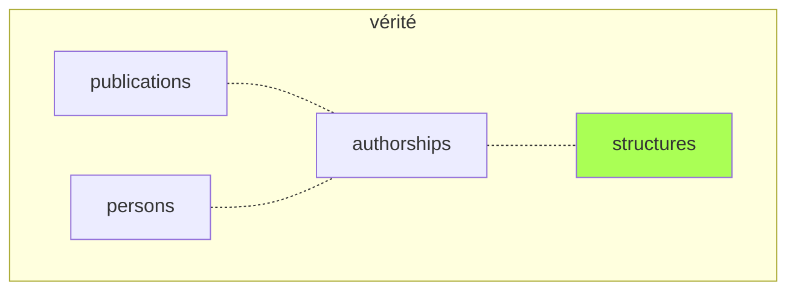
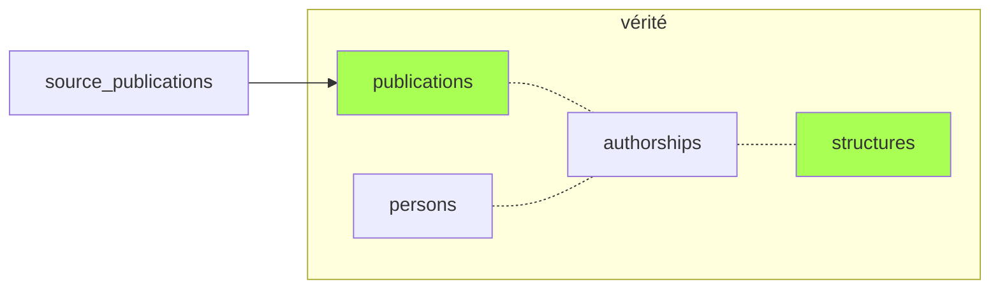
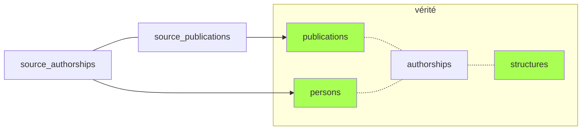
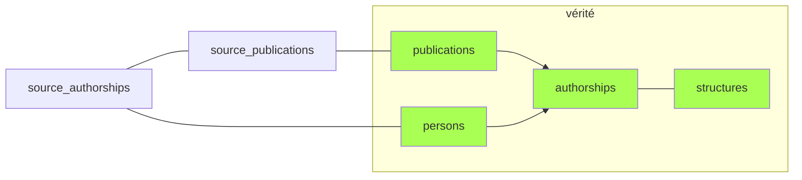

# Résumé : peuplement des tables canoniques

1. Les **structures** préexistent au pipeline.

2. La phase [`publications`](publications) peuple la table **publications** à partir des publications sources.

3. Après repérage des affiliations dans les authorships sources, la phase [`persons`](persons) crée les **personnes** correspondant aux *authorships* UCA (ou les rattache aux personnes existantes).

4. Les **authorships** canoniques sont déduites à partir des sources dans la phase [`authorships`](authorships). L'information (`person_id`, `structure_ids`) présente dans les *authorships* sources est donc répliquée dans la table *authorships* canonique, pour deux raisons :
    - optimiser les requêtes;
    - servir de source d'autorité ultime en cas d'erreur dans une des sources (une *authorship* source peut être `excluded`).

