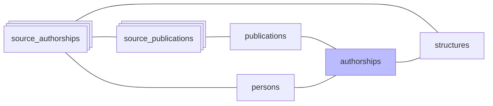

#  Authorships

*À jour le 2026-06-30.*

Phase `authorships` : trois opérations enchaînées.

`build_authorships` (re)construit la table canonique `authorships` — une ligne par paire (publication, personne) — à partir des `source_authorships` de toutes les sources (HAL, OpenAlex, WoS, ScanR, theses, Crossref). Le build est incrémental et convergent : relancé sans option, il aboutit au même état (les attributs divergents sont réécrits, les paires que plus aucune source n'atteste sont supprimées). Ses étapes :

1. **Insertion** des paires (publication_id, person_id) manquantes, **sauf** celles présentes dans `rejected_authorships` (rejet manuel, anti-join). Les publications de type `peer_review` et `memoir` (cf. `OUT_OF_SCOPE_DOC_TYPES` dans `domain/publications/scope.py`) ne donnent pas lieu à des authorships.
2. **Élagage** des authorships orphelines : les paires que plus aucune `source_authorship` n'atteste sont supprimées (le build étant additif, sans cet élagage un auteur retiré de toutes ses sources survivrait).
3. **Rattachement** : chaque `source_authorship` pointe vers son authorship canonique via `source_authorships.authorship_id`.
4. **Recomposition des attributs**, en une passe : `author_position` et `is_corresponding` (selon la priorité des sources : theses > Crossref > ScanR > HAL > OpenAlex > WoS), `in_perimeter` (vrai dès qu'une source le porte, posé en phase [affiliations](04-affiliations.md)), et `roles` (union des rôles déclarés par les sources).
5. **Report sur les publications** : `publications.in_perimeter` est matérialisé (les filtres de liste lisent ce drapeau plutôt que de recalculer l'appartenance à chaque requête).
6. **Rafraîchissement des vues matérialisées** `authorship_structures` et `publication_structures`, qui rattachent authorships et publications à leurs structures.

Suivent deux opérations de cohérence :

- **Purge des publications orphelines** : une publication qui ne porte plus aucune authorship (par exemple sortie du périmètre) est supprimée.
- **Recalcul des `pub_count`** des revues et des éditeurs, qui dérivent du nombre de publications du périmètre.