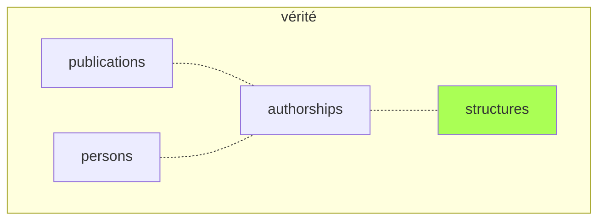
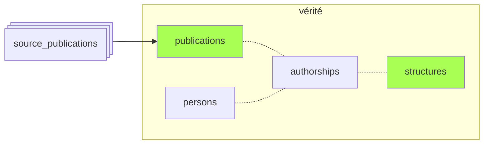
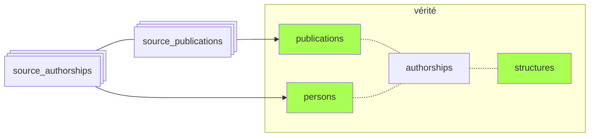
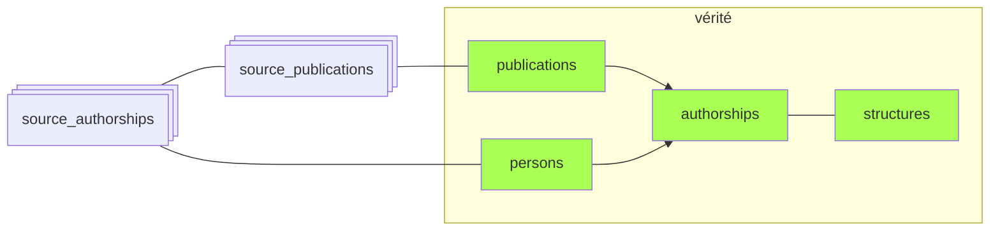

# Résumé : peuplement des tables canoniques

1. Les **structures** préexistent au pipeline.

2. La phase [`publications`](06-publications.md) peuple la table **publications** à partir des publications sources.

3. Après repérage des affiliations dans les authorships sources, la phase [`persons`](07-persons.md) crée les **personnes** correspondant aux *authorships* UCA (ou les rattache aux personnes existantes).

4. Les **authorships** “canoniques” sont déduites à partir des sources dans la phase [`authorships`](08-authorships.md). L'information (`person_id`, `structure_ids`) présente dans la table `source_authorships` est agrégée et répliquée dans la table `authorships`, pour deux raisons :
    - optimiser les requêtes;
    - servir de source d'autorité ultime en cas d'erreur dans une des sources (une `authorship` peut être rejetée (table `rejected_authorships`), ce qui garantit qu'elle ne sera pas recréée à partir des sources).

