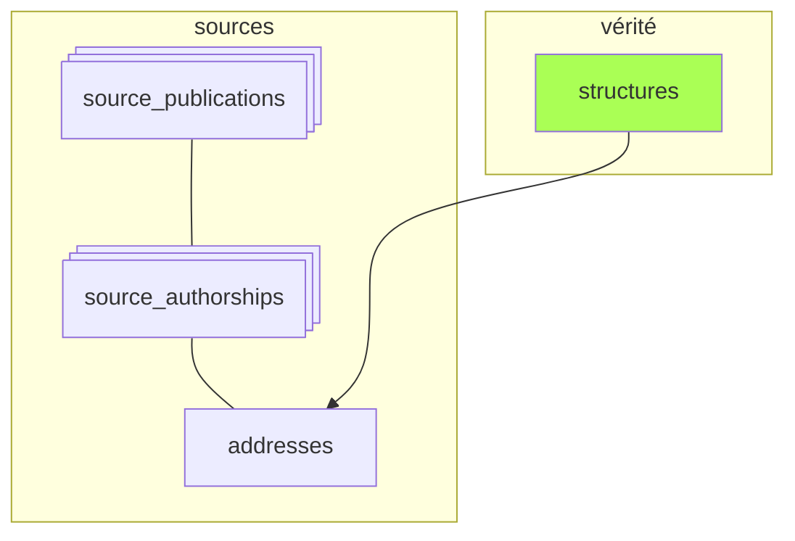
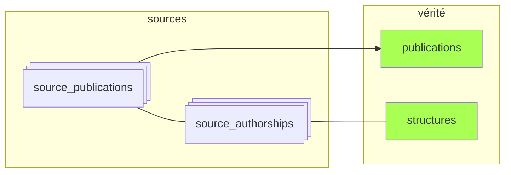
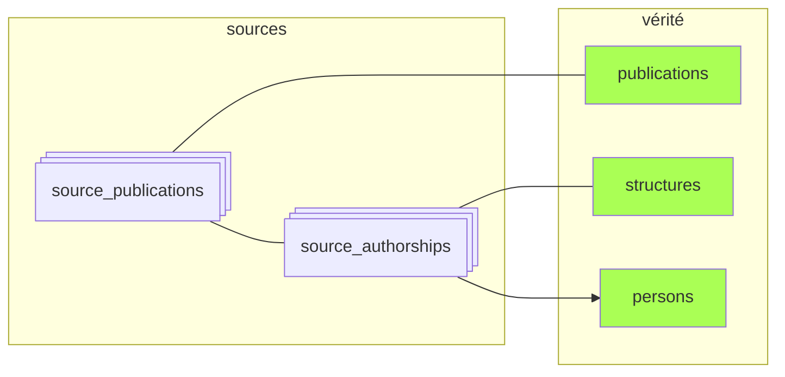
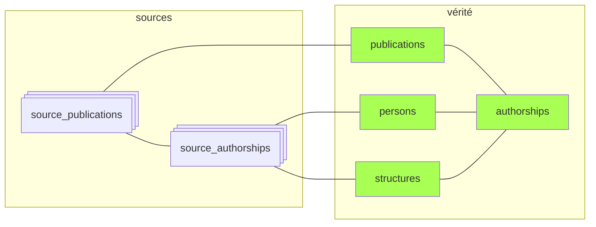

# Résumé : peuplement des tables canoniques

*À jour le 2026-06-30.*

1. Les **structures** préexistent au pipeline. Elles sont reconnues dans les adresses liées aux publications, et permettent de repérer les authorships (et indirectement les publications) du périmètre.

2. La phase [`publications`](07-publications.md) peuple la table **publications** par déduplication à partir des sources.

3. La phase [`persons`](09-persons.md) rattache les *authorships* du périmètre aux personnes existantes ou crée de nouvelles personnes.

4. La phase [`authorships`](10-authorships.md) crée les liens entre publications, personnes et structures canoniques. L'information portée par les `source_authorships` — l'auteur (`person_id`) et ses structures de rattachement — est agrégée dans la table `authorships` par union des sources.

